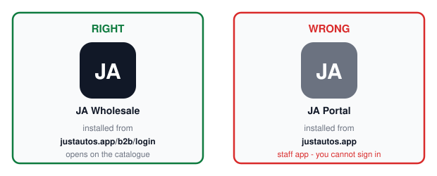
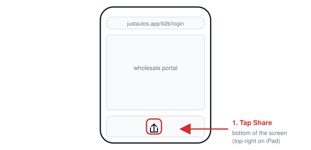
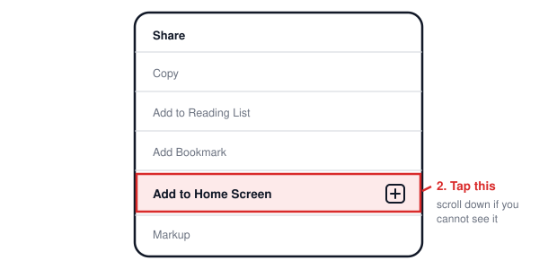
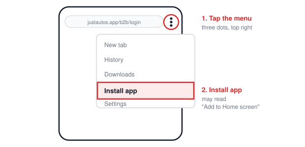
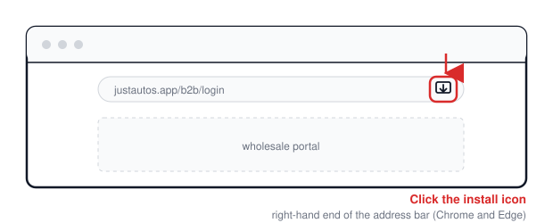

# Installing the Just Autos Wholesale app

How to put the wholesale portal on your computer, phone or tablet so it opens like an app instead of a browser tab.

For distributors. Takes about a minute per device.

---

## What you're installing

The wholesale portal can install itself as an app. You get:

- an icon on your desktop, home screen or dock
- it opens in its own window, with no address bar or browser tabs
- it starts on the catalogue, already signed in
- optional notifications when an order is confirmed or shipped

**There is nothing to download and nothing in the App Store or Google Play.** The app *is* the website — you install it from the website itself, and it updates itself. Searching the app stores for "Just Autos" will not find it.

---

## ⚠ Read this first — it decides whether you get the right app

**Start at the wholesale portal and sign in before you install:**

```
https://justautos.app/b2b/login
```

The web address has to have **`/b2b`** in it when you install. That is what tells your device to install **Just Autos Wholesale** rather than the Just Autos staff app.

If you install from `justautos.app` on its own, you will get the wrong app — a staff one you can't sign in to. If that happens, delete the icon and start again from the address above.

**Check you have the right one:** it is called **Just Autos Wholesale** (or **JA Wholesale** under the icon), and it opens on the parts catalogue.


*Install from a `/b2b` address and you get the wholesale app on the left. From the bare domain you get the staff app on the right, which you will not be able to sign in to.*

---

## iPhone and iPad

**You must use Safari.** Chrome, Firefox and Edge on an iPhone cannot install apps properly — the option is either missing or gives you a plain bookmark.

1. Open **Safari** and go to `justautos.app/b2b/login`.
2. Sign in.
3. Tap the **Share** button — the square with an arrow coming out of it, at the bottom of the screen (or top-right on an iPad).

   
   *The Share button is at the bottom of the screen in Safari on an iPhone, and top-right on an iPad.*

4. Scroll down the list and tap **Add to Home Screen**.
   - If you can't see it, scroll further — it sits below the sharing options. On an older phone you may need **Edit Actions** at the bottom to switch it on.

   
   *It sits below the sharing options - keep scrolling if you cannot see it straight away.*

5. The name should read **JA Wholesale**. Tap **Add** (top right).
6. Close Safari and open the new icon from your home screen.

---

## Android phone and tablet

1. Open **Chrome** and go to `justautos.app/b2b/login`.
2. Sign in.
3. Tap the **⋮** menu (three dots, top right).
4. Tap **Install app** — or **Add to Home screen** if that's what yours says.

   
   *Chrome on Android. Some phones word it "Add to Home screen" instead.*

5. Confirm with **Install**.
6. Open **JA Wholesale** from your home screen or app drawer.

Chrome often offers this by itself with a banner along the bottom of the screen. Tapping that banner does the same thing.

Samsung Internet and Edge work the same way; the menu wording differs slightly.

---

## Windows computer

Use **Chrome** or **Microsoft Edge**.

1. Go to `justautos.app/b2b/login` and sign in.
2. Look at the right-hand end of the address bar for the **install icon** — a small screen with a downward arrow (Edge shows a ⊞ symbol).
3. Click it, then click **Install**.


*Chrome and Edge on Windows or Mac - the icon only appears once you are on the wholesale portal.*

If you can't see the icon: open the **⋮** menu (Chrome) or **…** menu (Edge) → **Cast, save and share** on Edge → **Install this site as an app** / **Install Just Autos Wholesale**.

The app is then in your Start menu, and you can pin it to the taskbar like any other program.

---

## Mac computer

**Chrome or Edge:** exactly as Windows above — install icon at the right of the address bar, or the **⋮** menu → **Cast, save and share** → **Install this site as an app**.

**Safari (macOS Sonoma or newer):** go to the site, then **File → Add to Dock**.

The app appears in Launchpad and can stay in your Dock.

---

## Turning on notifications (optional)

Tells you when an order is confirmed and when it ships, without watching your email.

1. Open the installed app — **not** the browser.
2. Go to **Settings** in the app.
3. Under **Notifications**, press **Enable notifications**.
4. Your device will ask for permission. Choose **Allow**.

**On an iPhone or iPad this only works once the app is on your home screen** — notifications cannot be switched on from Safari. Install first, open the icon, then enable. You also need iOS 16.4 or later; if you're on something older, updating your phone is the fix.

If you tapped **Block** by mistake, the browser or phone will not ask again. Turn it back on in your device's settings for the app, then try again.

---

## Everyday use

- **Signing in:** you stay signed in. If it does ask, use your normal wholesale email and password.
- **Updates:** automatic. There is nothing to update and no version to check — closing and reopening the app picks up anything new.
- **More than one device:** install it on as many as you like. Your cart, orders and account are the same everywhere.
- **Removing it:** delete the icon like any other app. Your account and order history are untouched, and the website still works normally.

---

## If something isn't right

| What you're seeing | What it is | What to do |
|---|---|---|
| No install option anywhere | You're not on a `/b2b` page, or you're using a browser that can't install (Chrome/Firefox on an iPhone) | Go to `justautos.app/b2b/login`. On an iPhone use **Safari** |
| The app installed but says you can't access it | You installed the staff app from `justautos.app` instead of the wholesale one | Delete the icon and install again from `justautos.app/b2b/login` |
| It opens in a normal browser window with tabs | The icon is a bookmark, not the installed app | Delete it and follow the steps above — on an iPhone use **Add to Home Screen**, not "Add Bookmark" |
| **Add to Home Screen** is missing on iPhone | Scroll further down the share list, or you're not in Safari | Switch to Safari. If it's still missing, **Edit Actions** at the bottom of the share sheet turns it back on |
| Notifications won't switch on | On iPhone, the app isn't installed to the home screen yet, or permission was blocked earlier | Install first, then enable from inside the app. If you blocked it, re-allow in your device settings for the app |
| It asks you to sign in every time | The device is clearing site data between sessions, often "private browsing" or a cleaner app | Install from a normal (not private) window, and exclude the app from any cleaner |
| Prices or stock look out of date | A page held in memory | Close the app fully and reopen it |

Anything else, contact Just Autos and we'll sort it out.
