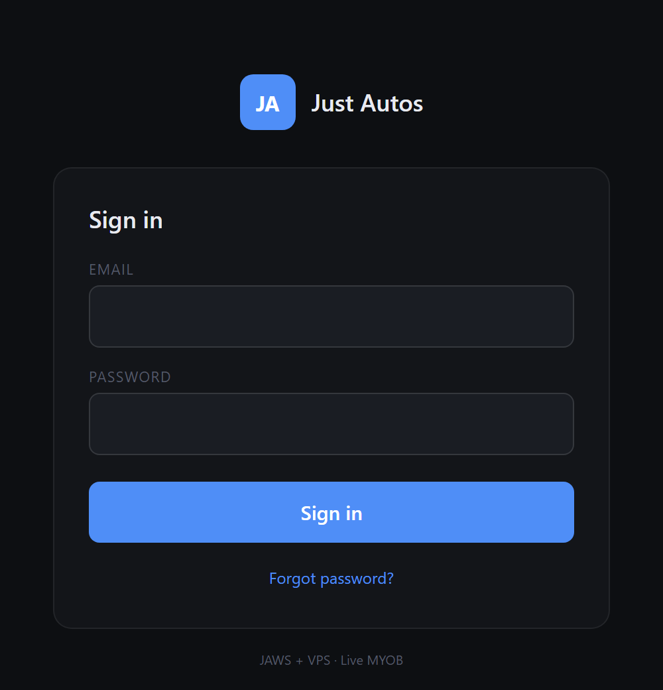
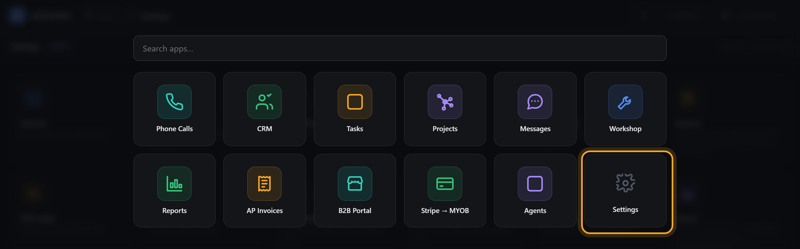
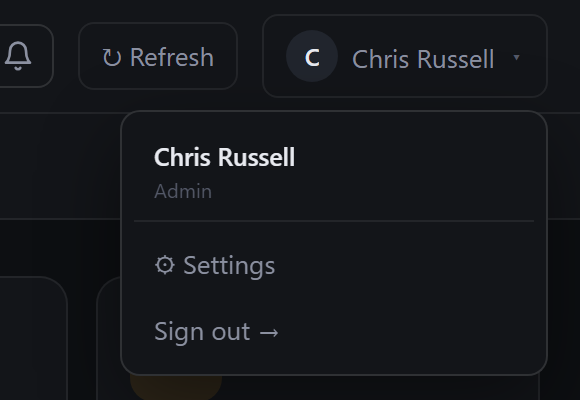
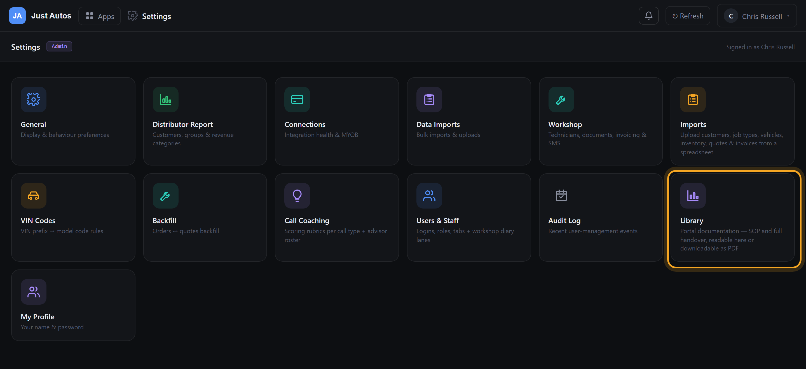
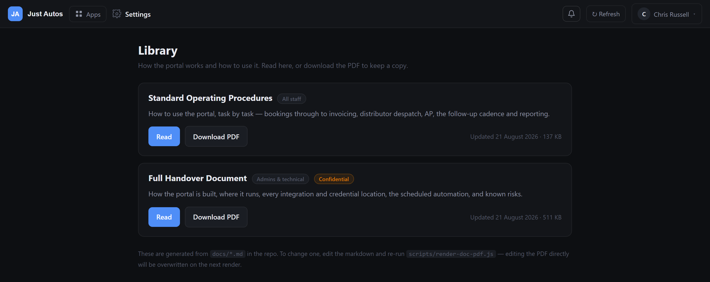
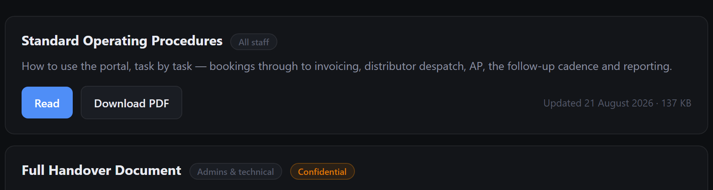
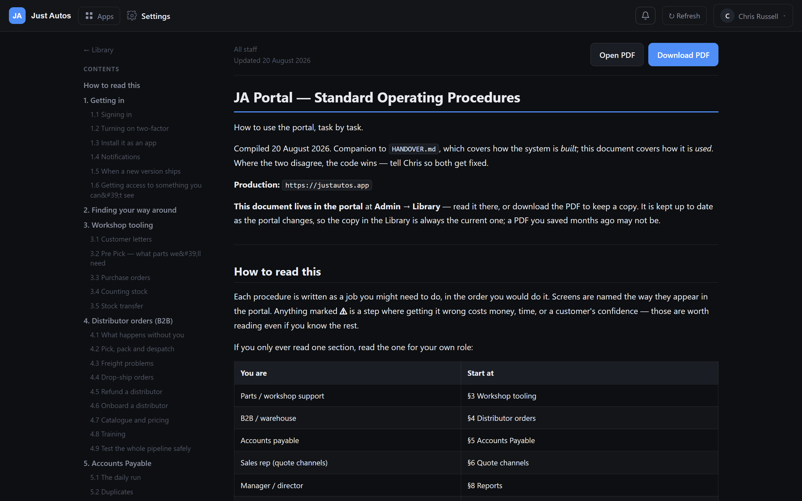

# Finding the SOP and Handover documents in the JA Portal

**Purpose.** Both of the portal's manuals live inside the portal itself, at **Settings → Library**. This procedure shows how to get to them, how to read them on screen, how to save a copy, and the rules for handling them.

**Applies to.** Everyone who needs the manuals. Opening the Library needs an **admin** login — see §2.

**Production portal:** `https://justautos.app`

---

## 1. What's in the Library

| Document | Who it's for | What it covers |
|---|---|---|
| **Standard Operating Procedures** | All staff | How to *use* the portal, task by task — bookings through to invoicing, distributor despatch, accounts payable, the quote follow-up cadence, and reporting. |
| **Full Handover Document** *(Confidential)* | Admins & technical | How the portal is *built* — where it runs, every integration and where its credentials live, the scheduled automation, and the current known risks. |

Both are generated from the portal's own source, and are updated whenever the portal changes, so the copy in the Library is always the current one.

> The Library is the only place these documents are published. They are deliberately **not** on the public website — the handover names where every credential lives, so it sits behind the sign-in.

---

## 2. Who can open it

The Library is gated on the **admin** permission (`admin:settings`). If your login is Manager, Sales, Workshop or any other role, the Library tile does not appear and the direct link will bounce you back.

If you need a copy and you're not an admin, ask an admin to download the PDF and send it to you — the SOP is fine to share internally; the handover is not (see §7).

---

## 3. Procedure — open the Library

### Step 1 — Sign in

Go to `https://justautos.app` and sign in with your portal email and password. If two-factor is switched on for your login, enter the 6-digit code from your authenticator app.

*Figure 1 — the portal sign-in screen. "Forgot password?" sends a reset email; it does not need an admin.*

### Step 2 — Open Settings

Two ways, whichever is in front of you:

**a. The Apps launcher** — click **Apps** in the top bar, then the **Settings** tile (bottom right of the grid).

*Figure 2 — the Apps launcher. Settings is the last tile. You can also type "settings" into the search box.*

**b. Your name, top right** — click your name, then **Settings**.

*Figure 3 — the user menu. This is the quickest route from any screen in the portal.*

### Step 3 — Click the Library tile

Settings opens as a grid of tiles. **Library** is on the second row, on the right — described as *"Portal documentation — SOP and full handover, readable here or downloadable as PDF"*.

*Figure 4 — the Settings tile grid, Library highlighted. Every other tile opens in a floating window; Library opens as its own page, so it can be bookmarked.*

### Step 4 — Pick a document

The Library lists both documents, each with what it is, who it's for, and when it was last updated.

*Figure 5 — the Library. The handover carries a **Confidential** badge.*

Each card gives you two buttons and a date:

*Figure 6 — card controls.*

| Control | What it does |
|---|---|
| **Read** | Opens the document on screen, with a contents rail for jumping between sections. Best for looking something up. |
| **Download PDF** | Saves a PDF copy to your device. Best for printing or reading offline. |
| **Updated (date · size)** | When the document itself last changed. If that date is months old, it means that area of the portal hasn't changed — not that the document was forgotten. |

---

## 4. Reading a document on screen

**Read** opens the reader: the document body on the right, a sticky **Contents** rail on the left.

*Figure 7 — the SOP open in the reader. Entries in the contents rail jump straight to that section.*

- Click any contents entry to jump to that section; the rail stays put as you scroll.
- **Ctrl+F** (**⌘F** on a Mac) searches the whole document — the fastest way to find one procedure.
- **← Library** at the top of the rail goes back to the list.
- **Open PDF** shows the PDF in a browser tab; **Download PDF** saves it.
- On a phone, or a narrow window, the contents rail is hidden and the document runs full width. Use your browser's find instead.

---

## 5. Direct links and bookmarks

Once you know the route, these are the fastest way back. All of them require an admin sign-in.

| What | Link |
|---|---|
| Library list | `https://justautos.app/admin/library` |
| SOP — read on screen | `https://justautos.app/admin/library/sop` |
| Handover — read on screen | `https://justautos.app/admin/library/handover` |
| SOP — PDF straight down | `https://justautos.app/api/admin/library/sop?download=1` |
| Handover — PDF straight down | `https://justautos.app/api/admin/library/handover?download=1` |

If you follow one of these while signed out, you land on the sign-in screen and are returned to the document once you're in.

---

## 6. Printing a copy

1. Open the document and click **Download PDF**.
2. Print from your PDF reader — both documents are laid out for A4 with page numbers.
3. Write the "Updated" date on the front page if you're pinning it up, so it is obvious later whether the printout is still current.

---

## 7. Handling rules

1. **Read it in the Library, not from an old saved copy.** The Library version is regenerated whenever the portal changes. A PDF saved months ago may describe a screen or a workflow that no longer exists — following it can send stock, freight or money the wrong way.
2. **The handover is confidential.** It names where every credential, server and integration lives. Do not email it outside Just Autos, do not upload it anywhere public, and do not hand it to a supplier or contractor without Chris's say-so. The **Confidential** badge on the card is there for that reason.
3. **The SOP is fine to share internally** with any staff member who needs it, including those without an admin login.
4. **Don't edit a downloaded PDF and pass it around.** It is overwritten at the next update and the change vanishes. If something in a document is wrong or out of date, tell Chris — the fix goes into the source, so everyone gets it.

---

## 8. If something is wrong

| What you see | What it means | What to do |
|---|---|---|
| No **Library** tile in Settings | Your login isn't an admin | Ask an admin for the PDF, or ask Chris whether your role should change |
| The direct link bounces you to sign-in | Session expired, or not an admin | Sign in again; if it still bounces, it is a permissions issue |
| **"PDF not built"** on a card | The PDF hasn't been regenerated since the last edit | Use **Read** — the on-screen copy is current. Tell Chris so the PDF gets rebuilt |
| An old **Updated** date | Usually nothing — that area of the portal hasn't changed | Only worth raising if you know a change shipped and the document doesn't mention it |
| The document contradicts what the portal actually does | The portal changed and the document lagged | The portal wins. Tell Chris so the document is corrected |

---

## 9. Keeping the documents current (admins)

The markdown in the repo's `docs/` folder is the source of truth; the reader renders it live and each PDF is a generated artefact.

- Any change to the portal updates `docs/SOP.md` (how it is used) and/or `docs/HANDOVER.md` (how it is built) **in the same piece of work**.
- After editing, regenerate the PDFs with `scripts/render-doc-pdf.js` and commit them alongside the markdown — otherwise the on-screen copy is current while the download is stale.
- Editing a PDF directly achieves nothing: the next render overwrites it.

---

## Quick reference

> **Sign in → Settings (Apps launcher, or your name → Settings) → Library → Read, or Download PDF.**
>
> Admin logins only. The handover is confidential. Always read the Library copy, never an old download.
